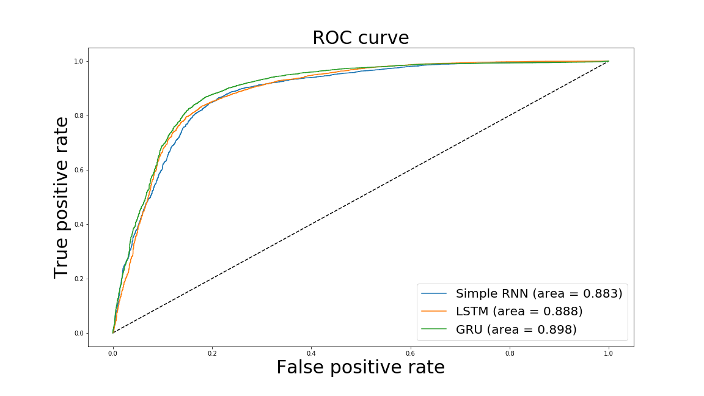

## Summary
This project uses product review_body and verfied_purchase columns from Amazon Review Dataset to train machine learning models, Simple RNN, Long Short Term Memory Unit (LSTM) and Gated Recurrent Unit(GRU) and test predictions, using Tensorflow library. 

## Business Application
- This project could identify the hidden actual users, who bought the product from any store other than Amazon because a review without a verified purchase may or may not be a valid review from an actual user, but a review with a verified purchase is from an actual user. 
- The practical use of the project will be displaying product reviews strategically to increase sales ethically. 
    - For example, many users only read reviews from uses with verified purchases. So the verified purchase information can be displayed passively, namely, a user has to click a button to show the verified purchase information. 
    
## Directory
```
root
├── Capstone 3
│   ├── README.md
│   ├── eda.ipynb                   # EDA Notebook
│   ├── results                     
│   │   ├── roc.png
│   │   └── clean_data_frame.p      # large data file ignored
│   ├── task.log                    # log file for task_runner.py
│   └── task_runner.py              # train and test models, log results in task.log 
├── scripts
│   ├── data_migration.ps
│   └── etl.sh
└── tests
    ├── sample_us.tsv
    └── benchmark.ipynb
```
## Assumptions
- Apparel category data is the only data used for this project
- Data on the storage server are mounted
- A symbolic link, Data, is to the mounted data
- Data is pre-processed, html tags removed and text cases lowered using ../scripts/[etl.sh](https://github.com/0xd5dc/amazon-review-validator/blob/master/scripts/etl.sh)
- Tensorflow 2.0.1 stable version installed
- latest Pandas, Numpy, pickle, sklearn, matplotlib is properly installed via pip

## Data Preparation
### Data Source
Amazon Customer Reviews (a.k.a. Product Reviews) is one of Amazon’s iconic products. In a period of over two decades since the first review in 1995, millions of Amazon customers have contributed over a hundred million reviews to express opinions and describe their experiences regarding products on the Amazon.com website. 

### Access data 
1. Copy data from AWS S3 to Azure 
    ```
    azcopy cp "https://s3.amazonaws.com/mybucket/" "https://mystorageaccount.blob.core.windows.net/mycontainer<SAS>" --recursive
    ```
    For complete guide check [AWS S3 to Azure](https://azure.microsoft.com/en-us/blog/move-your-data-from-aws-s3-to-azure-storage-using-azcopy/)
    > ../scripts/[data_migration.ps](https://github.com/0xd5dc/amazon-review-validator/blob/master/scripts/data_migration.ps) copies the entire Amazon review dataset to Azure storage account once the credential is provided.
2.  Create fuse_connection.cfg
    ```
    # fuse_connection.cfg
    accountName <my azure storage account>
    accountKey <my password>
    containerName s3bucket
    ```

3.  In terminal
    ```
    sudo blobfuse ~/blobs/mycontainer --tmp-path=/mnt/resource/blobfusetmp  --config-file=/home/azureuser/blobs/fuse_connection.cfg -o attr_timeout=240 -o entry_timeout=240 -o negative_timeout=120 -o allow_other
    
    sudo ln -s ~/blobs/mycontainer /path/to/project/data
    ```

4. Data used in [eda.ipynb](eda.ipynb) is amazon_reviews_us_Apparel_v1_00 
> For more detail check [Data Index](https://s3.amazonaws.com/amazon-reviews-pds/tsv/index.txt)
>
> Sample Data is in ../tests/[sample.tsv](https://github.com/0xd5dc/amazon-review-validator/blob/master/tests/sample_us.tsv)
## Development Objectives
1. Prepare data for models
    - [x] select text and a label
    - [x] lower the text cases
    - [x] remove not words
    - [x] re-sample the data by undersampling
    - [x] split data into train, test set
2. Build models
    - [x] train and test with Simple RNN
    - [x] train and test with LSTM
    - [x] train and test with GRU
    - [x] compare the results
3. Output formatted data for visual aids
    - [x] generate c curves
    - [x] make presentation slides
4. Deploy to the Spark Cluster
    - [x] create spark clusters
    
## Results
### Metrics
- Accuracy
    - Calculates how often predictions matches labels.
- Precision
    - Computes the precision of the predictions with respect to the labels.
- Recall
    - Computes the recall of the predictions with respect to the labels.

### Evaluations


One of the results using 5000 samples with data from Apparel category

- Simple RNN
    - val_loss: 0.9035 
    - val_accuracy: 0.7927 
    - val_recall_4: 0.7726 
    - val_precision_4: 0.9341
- 2 Layer LSTM
    - val_loss: 1.1111 
    - val_accuracy: 0.7949 
    - val_recall_5: 0.7702 
    - val_precision_5: 0.9401
- GRU
    - val_loss: 0.6237 
    - val_accuracy: 0.8052 
    - val_recall: 0.7842 
    - val_precision: 0.9411
    
> ./[task_runner.py](task_runner.py) is used to generate results with sample sizes of 1,000, 5,000, 10,000, 50,000.
>
>Results are various because of the re-sampling. However, the accuracy does not improve after the size of the sampling exceeded 5,000.
>
>The precision wouldn't increase despite the increment of data points because of the false positive, which is reasonable as users bought the same products from other retailers will write valid reviews similar to users with verified purchases. Unlike using LSTM model to predict star rating from review text can reach 99% precision.
## Future Research
- Identify the hidden actual users, who bought the product from any store other than Amazon
- Recommend review display strategies
    - for different users, display review accordingly
- Product improvement suggestion for businesses

## REFERENCES
- [Amazon Customer Reviews](https://s3.amazonaws.com/amazon-reviews-pds/readme.html)
- [Tensorflow Metrics](https://www.tensorflow.org/api_docs/python/tf/keras/metrics)
- [TensorFlow On Spark: Scalable TensorFlow Learning on Spark Clusters](https://databricks.com/session/tensorflow-on-spark-scalable-tensorflow-learning-on-spark-clusters)
- [TensorFlow On Spark Github](https://github.com/yahoo/TensorFlowOnSpark)
- [Tensorflow on Databricks](https://docs.databricks.com/applications/deep-learning/single-node-training/tensorflow.html)
- [Azure Databricks tutorial for TensorFlow developers](https://tsmatz.wordpress.com/2018/05/09/databricks-tensorflowonspark-example/)
## SHORTCUTS
[Index](https://github.com/0xd5dc/amazon-review-validator/)

[Capstone 1](https://github.com/0xd5dc/amazon-review-validator/blob/master/Capstone%201/README.md)

[Capstone 2](https://github.com/0xd5dc/amazon-review-validator/blob/master/Capstone%202/README.md)

[Capstone 3](https://github.com/0xd5dc/amazon-review-validator/blob/master/Capstone%203/README.md)
